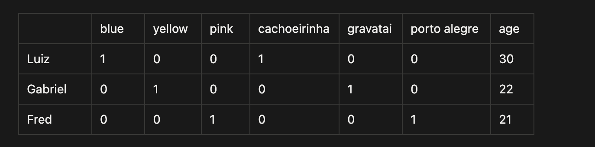
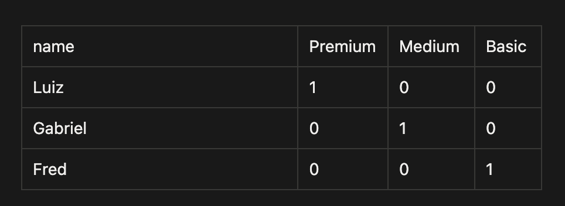

## Project 00

I create a simple code to understand better somes properties of train models with tensorflow

### What is the project?
It is a simple system to add label `premium`, `medium`, `basic` to a new user

### Techs
- Javascript
- node 
- Tensor Flow


### Data i used to train
```javascript
const people = [
	{ name: "Luiz", age: 30, color: "blue", localization: "cachoeirinha" },
	{ name: "Gabriel", age: 22, color: "yellow", localization: "gravatai" },
	{ name: "fred", age: 21, color: "pink", localization: "porto alegre" }
]

const categories = [
	"Luiz", "premium",
	"Gabriel", "medium",
	"Fred", "basic"
]
```

### Normalized data

```javascript
const peopleTensor = [
    [30, 1, 0, 0, 1, 0, 0],
	[22, 0, 1, 0, 0, 1, 0],
	[21, 0, 0, 1, 0, 0, 1],
]
```
- the model learn better when all datas is on the same scale
- need normalized the ages to get the range 0 and 1
   - 0 → minimum age of the dataset
   - 1 → maximum age of the dataset
   - values between 0 and 1 → relative position between minimum and maximum
```
age_normalized = (age - min_age) / (max_age - min_age)
```
- after normalization
```javascript
const peopleTensor = [
	[1, 1, 0, 0, 1, 0, 0], // Luiz
	[0.11, 0, 1, 0, 0, 1, 0], // Gabriel
	[0, 0, 0, 1, 0, 0, 1], // Fred
]
```

- Categories


### Code with explanation
```javascript
import tf from '@tensorflow/tfjs-node';

async function trainModel(inputXs, outputYs){
    const model = tf.sequential();
    model.add(tf.layers.dense({ inputShape: [7], units: 80, activation: 'relu' }));

    // output layer with 3 units
    // softmax activation function to get probabilities for each class
    model.add(tf.layers.dense({ units: 3, activation: 'softmax'}));
    // Optimizer Adam (Adaptive Moment Estimation)
    // adjusts weights efficiently and intelligently
    // learns from history of errors and successes

    // loss: compares the scores of each category with the correct answer
    // the further from the prediction, the greater the error
    // image classification, recommendations, categorizing users, 1 option for returns
    model.compile({ optimizer: 'adam', loss: "categoricalCrossentropy", metrics: ['accuracy']})

    // epochs: will pass through the database 100 times
    // verbose: will not show logs
    // shuffle: shuffles the data at each epoch to prevent the model from learning the order of the data and avoid a biased algorithm
    await model.fit(inputXs, outputYs,{
        verbose: 0,
        epochs: 100,
        shuffle: true,
        callbacks: {
            onEpochEnd: (epoch, logs) => {
                console.log(`Epoch: ${epoch}, Loss: ${logs.loss}, Accuracy: ${logs.acc}`)
                
            }
        }
    })
    // salva em disco

    return model;

}

async function predict(model, person){
    // transforms the array into a tensor
    const tfInput = tf.tensor2d(person)
    // makes the prediction, the output will be a vector of 3 probabilities, one for each category
    const pred = model.predict(tfInput)
    const predArray = await pred.array()
    return predArray[0].map((prob, index) => ({
        prob, index
    }))
}

const peopleTensorNormalized = [
	[1, 1, 0, 0, 1, 0, 0], // Luiz
	[0.11, 0, 1, 0, 0, 1, 0], // Gabriel
	[0, 0, 0, 1, 0, 0, 1], // Fred
]

const labels = ["Premium", "Medium", "Basic"]
const tensorLabels = [
	[1, 0, 0], // Luiz - premium
	[0, 1, 0], // Gabriel - medium 
	[0, 0, 1] // Fred - basic
]

const inputXs = tf.tensor2d(peopleTensorNormalized)
const outputYs = tf.tensor2d(tensorLabels)

const model = await trainModel(inputXs, outputYs)

// people who were not in training, to test the model
const person = { name: "Pedro", age: 24, color: "pink", localization: "porto alegre" };
const personTensorNormalized = [[0.1, 0, 0, 1, 0, 0, 1]]

const predictions = await predict(model, personTensorNormalized)
const result = predictions.sort((a, b) => b.prob - a.prob).map(p => `${labels[p.index]} (${(p.prob * 100).toFixed(2)}%)`).join("\n")

console.log(result)
```